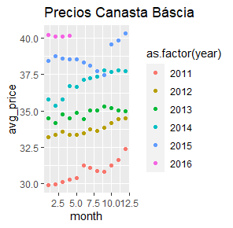

# Quién es Quién en los Precios
## Instrucciones
Los ejercicios fueron resuletos usando `sparklyr`.   
El código completo utilizado se encuentra en el archivo `profeco_aprklyr.R`.  
Algunos resultados están en el archivo `top.csv`

## Procesamiento de datos
* Número de registros: 62530715
* Número de categorias: 41
* Número de cadenas monitoreadas: 705
* Calidad de datos e inconsistencias:
1. Hay algunos nombres de calles dentro de los estados
2. También encontramos algunos valores nulos

* Top producto monitoreado por estado: Los resultados se reportan en el archivo top.csv
Algunos ejemplos son:

|Estado|Producto mas Monitoreado|Cuentas|
|-|-|-|
|JALISCO|	REFRESCO|	81718|
|MÉXICO|	REFRESCO	|194939|
|MICHOACÁN DE OCAMPO|	DETERGENTE P/ROPA	|40144|
|MORELOS|	REFRESCO|	9632|

* Cadena comercial con mayor variedad de productos monitoreados: Soriana con 1059 productos

## Análsis Exploratorio
* Genera una canasta básica.  
La canasta basica publicada por el gobierno de México cuenta con 40 artículos de los cuales 39 son alimentos y productos de cuidado personal.  
En los datos seguiremos el siguiente proceso para seleccionar la canasta básica:  
1. Quitamos todos los elementos de categorias que no están en la canasta báscia del gobierno.
2. Seleccionamos los 40 productos con más registros. Suponiendo que los productos básicos son los que más se monitorean.
3. Removemos los municipios que tienen menos de 1000 cuentas.
Con esos pasos obtenemos una lista que contiene los productos de la canasta báscia.

* De acuerdo con el análisis de la canasta báscia la ciudad más cara del país es **cozumel** con un precio promedio de los elementos de la canasta báscia de $42.2 y la ciudad más barata es **Tlahuac** con un precio promedio de $13.4

* Para buscar comportamientos estacionales en los precios de la canasta básica con autocorrelaciones, no se detecta muestran ningún comportamiento estacional

Autocorrelations of series ‘avg_price’, by lag
| | | | | | | | | | | | | | |
|-|-|-|-|-|-|-|-|-|-|-|-|-|-|
|Lag  |  0 |    1 |    2|     3|     4|     5|     6|     7|     8|     9|    10|    11|    12|
|Corr|1.000 |0.942| 0.883 |0.823| 0.763| 0.703 |0.655| 0.605 |0.572| 0.531| 0.485| 0.438| 0.395|

Tampoco se aprecia ningún comportamiento estacional en la gráfica de los precios.

* Los estados más caros y durante que mes se muestran a continuación:
| id |estado          |month |avg_price|
|-|-|-|-|
|1 | SAN LUIS POTOSI|     3|      42.7|
|2 |SAN LUIS POTOSI |     4|      42.6|
|3 |GUERRERO        |   12 |      42.6|
|4 |SAN LUIS POTOSI |    2 |      42.2|
|5 |SAN LUIS POTOSI |   12 |      42.1|

* Los riesgos de analizar series de tiempo con estos datos es que estamos observando cuentas de observaciones que se tomaron sin tener un patrón claro. Esto puede llevarnos a sesgos por aumentos de observaciones en algunos lugares y falta de revisión en otros lugares.
